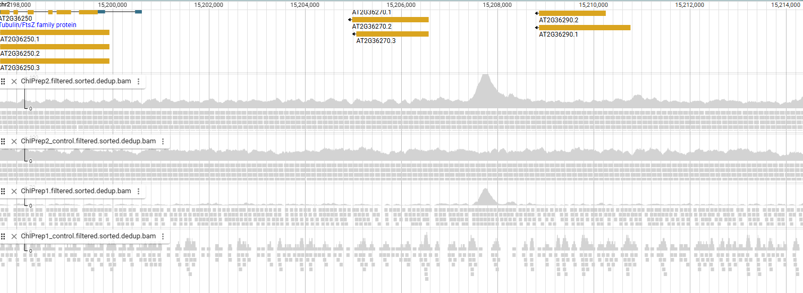
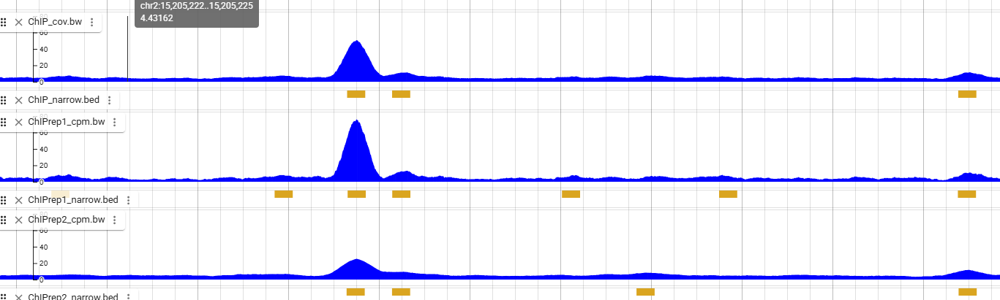
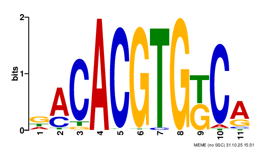
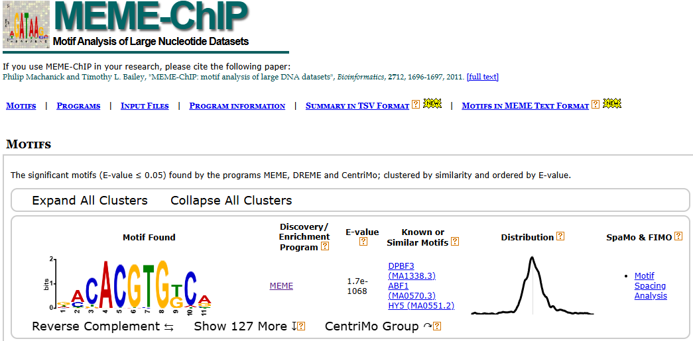
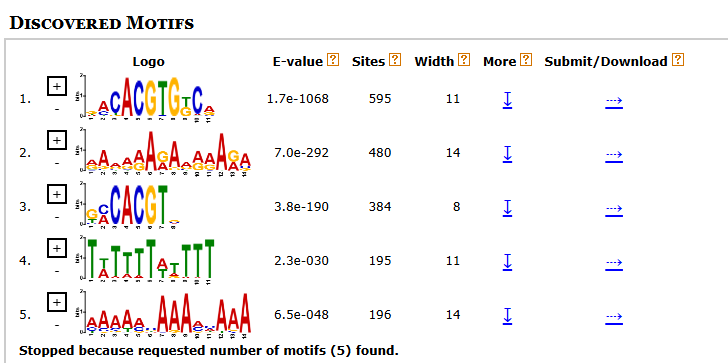
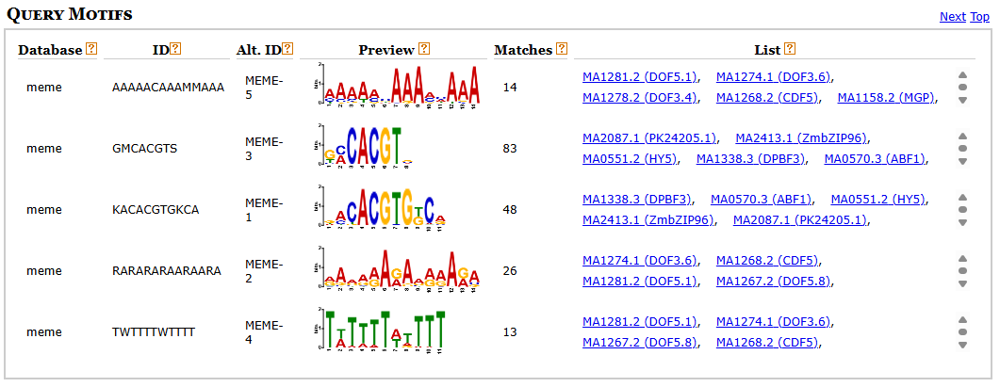
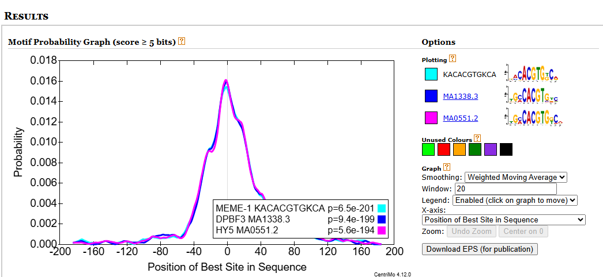
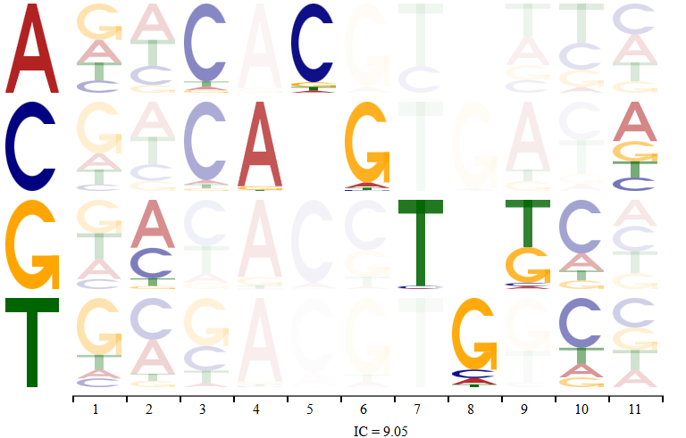

# TF_genomic_analysis Pipeline Tutorial

## Introduction

This tutorial demonstrates the **TF_genomic_analysis** functions using a small example dataset. It covers all functions in the `compil_functions.sh` script, with the some nessary scripts available in the `TF_genomic_analysis/bin/` directory.

**Pipeline Workflow:**
Our functions are designed to work in pipeline as a series of interconnected steps, where the output of one function serves as the input for the next. You can use our function as bricks to feed a workflow gestionary.

---

## Lexicon

| Term      | Description                                                              |
|-----------|--------------------------------------------------------------------------|
| ChIP-seq  | Chromatin Immunoprecipitation followed by sequencing                     |
| DAP-seq   | DNA Affinity Purification followed by sequencing                         |
| ampDAP-seq| Amplified DNA Affinity Purification followed by sequencing               |
| TF        | Transcription Factor                                                     |
| TFBS      | Transcription Factor Binding Site                                        |

---

## Table of Contents

1. [Configuration, Requirements and Installation](#requirements-and-installation)
2. [Genomic Analysis Tools utorial](#genomic-analysis-tools)
   - [Downloading FASTQ Data](#1-downloading-fastq-data)
   - [Mapping Reads](#2-mapping-reads)
   - [Peak Calling](#3-peak-calling)
   - [Modeling TFBS](#4-modeling-tfbs)
   - [Model Performance](#5-model-performance)
   - [Comparing Peaks Coverage](#6-comparing-peaks-coverage)
   - [Scores Distributions](#7-scores-distributions)
   - [Analyzing TFBS Syntax](#8-analyzing-tfbs-syntax)


---

## Configuration, Requirements and Installation

Please refer to the config.sh file avalaible in the tutorial repository for detailed installations requirements.

### Conda Environment

The pipeline requires two Conda environments, which can be set up using the provided YAML file:

```bash
# Create your environment based on YAML
conda env create -f TF_genomic_analysis/conda_TFgenomics.yml --name <your_env_name>
conda env create -f TF_genomic_analysis/conda_MACS3.yml --name <your_env_name>
# OR
conda env create -f TF_genomic_analysis/conda_env.yml --prefix <your_path>
conda env create -f TF_genomic_analysis/conda_MACS3.yml --prefix <your_path>

# Activate your environment 
conda activate <your_env_name>
# OR
conda activate <your_path>
```	

### External softwares you will need 

Some tools and softwares will be asked you to be installed manually. They are listed in the config.sh file. 

--- 

## Tutorial

### 0 - Data Availability 

This tutorial uses the ABI5 dataset, a Basic/bZIP protein with ChIP, DAP, and ampDAP samples. The raw sequencing data includes:

- ChIP-seq: Replicates SRR1537401 and SRR1537403 (O'Malley et al., 2016). Controls used are identified as SRR1537402 and SRR1537404.
- DAP-seq: Replicate SRR2926841 (O'Malley et al., 2016). Control used is identified as SRR2926068.
- ampDAP-seq: Replicate SRR2926840 (O'Malley et al., 2016). Control used is identified as SRR2926069.

> NCBI : https://www.ncbi.nlm.nih.gov/sra


---
mv 
### 1 -  Downloading FASTQ Data

Use the download_SRA function to download raw sequencing data:

```bash
source compil_functions.sh ;
# DOCUMENTATION: 
	# FUNCTION: download_SRA
	# DESCRIPTION:
	#   This function downloads SRA (Sequence Read Archive) files using the SRA Toolkit.
	#   It supports both single-ended and paired-ended reads and compresses the output
	#   into gzipped FASTQ files. The function also allows specifying the number of threads
	#   for parallel processing.
	#
	# USAGE:
	#   download_SRA -f <LIST> -o <PATH> -t [INT] -n <NAMES>
	#
	# ARGUMENTS:
	#   -f <LIST>   : A list of SRA IDs to download (required).
	#   -o <PATH>   : The output directory where the downloaded files will be stored (required).
	#   -t [INT]    : The number of threads to use for parallel processing (optional, default: 1).
	#   -n <NAMES>  : A list of names to rename the downloaded files (optional).
	#   -h, --help  : Display usage information for the function.
	#
	# NOTES:
	#   - Single-ended files are saved as <name>.fastq.gz.
	#   - Paired-ended files are saved as <name>_R1.fastq.gz and <name>_R2.fastq.gz.

# VARIABLES
OUTPUT_DIR="results/ABI5/FASTQ/"
# ChIP SRA
SRR_ChIP=("SRR1537401" "SRR1537403")
SRR_ChIP_control=("SRR1537402" "SRR1537404")
ChIP_names=("ChIPrep1" "ChIPrep2")
ChIP_control_names=("control_ChIPrep1" "control_ChIPrep2")
# DAP SRA
SRR_DAP=("SRR2926841")
SRR_DAP_control=("SRR2926068")
DAP_names=("DAPrep1")
DAP_control_names=("control_ampDAPrep1")
# ampDAP SRA
SRR_ampDAP=("SRR2926840")
SRR_ampDAP_control=("SRR2926069")
ampDAP_names=("ampDAPrep1")
ampDAP_control_names=("control_ampDAPrep1")

# CALLS
# ChIP-seq
download_SRA -f SRR_ChIP[@] -o $OUTPUT_DIR -t 5 -n ChIP_names[@]
# controls 
download_SRA -f SRR_ChIP_control[@] -o $OUTPUT_DIR/controls -t 5 -n ChIP_control_names[@]

# DAP-seq
download_SRA -f SRR_DAP[@] -o $OUTPUT_DIR -t 5 -n DAP_names[@]
# controls
download_SRA -f SRR_ampDAP_control[@] -o $OUTPUT_DIR/controls -t 5 -n DAP_control_names[@]

# ampDAP-seq
download_SRA -f SRR_DAP[@] -o $OUTPUT_DIR -t 5 -n ampDAP_names[@]
# controls
download_SRA -f SRR_ampDAP_control[@] -o $OUTPUT_DIR/controls -t 5 -n ampDAP_control_names[@]
```

#### Expected Output:

> In result FASTQ file you dhould get ChIP.fastq.gz, ampDAP.fastq.gz and DAP.fastq.gz 

```
TF_genomic_analysis/
└─── tutorial/
     └─── results/
          └─── ABI5/
               └─── FASTQ/
                    ├── ampDAPrep1.fastq.gz
                    ├── DAPrep1.fastq.gz
                    ├── ChIPrep1.fasta.gz
                    └── ChIPrep2.fasta.gz
					└─── controls/
					     ├── control_ChIPrep1.gz
                         ├── control_ChIPrep2.gz
                         ├── control_DAPrep1.gz
                         └── control_ampDAPrep1.gz

```

---

### 2 - Mapping Reads

Once FASTQ are download, you can map the associated sequenced reads to the genome of your choice with the `main_mapping` function as below: 

```bash
source compil_functions.sh ;

# DOCUMENTATION
	# FUNCTION: main_mapping_Fastq
	# DESCRIPTION:
	#   This function performs the mapping of FASTQ files using Bowtie2 
	#   (mapping_Fastq_bowtie2). It accepts various arguments to configure the 
	#   input/output directories, FASTQ files, processing parameters, and other 
	#   options. The function validates the input arguments, prepares the necessary 
	#   files, and calls the Bowtie2 mapping function with the specified parameters.
	#
	# USAGE:
	#   main_mapping_Fastq -fd <PATH> -md <PATH> -f1 <FILE> -f2 [FILE] -n <STRING> 
	#                      -s [INT] -pr [INT] -dedup [INT or "all" or "auto"] 
	#                      -size [FILE] -in [PATH] -debug -multialign
	#
	# ARGUMENTS:
	#   -fd <PATH>       : Path to the directory containing FASTQ files.
	#   -md <PATH>       : Path to the directory where mapping results will be stored.
	#   -f1 <FILE>       : FASTQ file for pair 1 or single-end reads.
	#   -f2 [FILE]       : FASTQ file for pair 2 (optional, for paired-end reads).
	#   -n <STRING>      : Name of the dataset (used for naming output files).
	#   -s [INT]         : Seed for random number generation (default: 1254).
	#   -pr [INT]        : Number of threads to use for processing (default: 1).
	#   -dedup [INT]     : Deduplication setting (1, "all", "auto", or other values).
	#   -size [FILE]     : Path to the size file (e.g., chromosome size file).
	#   -in [PATH]       : Path to the Bowtie2 index files.
	#   -debug           : Enable debug mode for additional logging.
	#   -multialign      : Allow multimapped reads ("canbe") or filter them out ("none").
	#   -h, --help       : Display usage information for this function.
	#
	# NOTES:
	#   - The function supports both single-end and paired-end FASTQ files.

# VARIABLES
CHROMSIZE="data/tair10.chromsize"
MAIN_DIR="TF_genomic_analysis"
# ChIP
fastq_ChIPrep1="results/ABI5/FASTQ/ChIPrep1.fastq.gz"
fastq_ChIPrep2="results/ABI5/FASTQ/ChIPrep2.fastq.gz"
fastq_ChIPrep1_control="results/ABI5/FASTQ/controls/control_ChIPrep1.fastq.gz"
fastq_ChIPrep2_control="results/ABI5/FASTQ/controls/control_ChIPrep2.fastq.gz"
name_ChIPrep1="ChIPrep1"
name_ChIPrep2="ChIPrep2"
# DAP
fastq_DAP=("results/ABI5/FASTQ/DAPrep1.fastq.gz")
fastq_R1_DAP_control=("results/ABI5/FASTQ/controls/control_DAPrep1_R1.fastq.gz")
fastq_R2_DAP_control=("results/ABI5/FASTQ/controls/control_DAPrep1_R2.fastq.gz")
name_DAP="DAPrep1"
# ampDAP
fastq_ampDAP=("results/ABI5/FASTQ/ampDAPrep1.fastq.gz")
fastq_R1_ampDAP_control=("results/ABI5/FASTQ/controls/control_ampDAPrep1_R1.fastq.gz")
fastq_R2_ampDAP_control=("results/ABI5/FASTQ/controls/control_ampDAPrep1_R2.fastq.gz")
name_ampDAP="ampDAPrep1"

# CALLS
# ChIP-seq (Single-End sample and control)
# rep1
main_mapping_Fastq -fd "$MAIN_DIR/tutorial/results/ABI5/FASTQ/" -md "$MAIN_DIR/tutorial/results/ABI5/Mapping/" -f1 $fastq_ChIPrep1 -n "ChIPrep1" -pr 5 -dedup 1 -size "$CHROMSIZE" -in "$INDEX"
main_mapping_Fastq -fd "$MAIN_DIR/tutorial/results/ABI5/FASTQ/controls/" -md "$MAIN_DIR/tutorial/results/ABI5/Mapping/controls/" -f1 $fastq_ChIPrep1_control -n $name_ChIPrep1 -pr 5 -dedup 1 -size "$CHROMSIZE" -in "$INDEX"
# rep2
main_mapping_Fastq -fd "$MAIN_DIR/tutorial/results/ABI5/FASTQ/" -md "$MAIN_DIR/tutorial/results/ABI5/Mapping/" -f1 $fastq_ChIPrep2 -n "ChIPrep2" -pr 5 -dedup 1 -size "$CHROMSIZE" -in "$INDEX"
main_mapping_Fastq -fd "$MAIN_DIR/tutorial/results/ABI5/FASTQ/controls/" -md "$MAIN_DIR/tutorial/results/ABI5/Mapping/controls/" -f1 $fastq_ChIPrep2_control -n $name_ChIPrep2 -pr 5 -dedup 1 -size "$CHROMSIZE" -in "$INDEX"

# DAP-seq (Single-End sample and Pair-End control)
main_mapping_Fastq -fd "$MAIN_DIR/tutorial/results/ABI5/FASTQ/" -md "$MAIN_DIR/tutorial/results/ABI5/Mapping/" -f1 $fastq_DAP -n "DAPrep1" -pr 5 -dedup 1 -size "$CHROMSIZE" -in "$INDEX"
main_mapping_Fastq -fd "$MAIN_DIR/tutorial/results/ABI5/FASTQ/controls/" -md "$MAIN_DIR/tutorial/results/ABI5/Mapping/controls/" -f1 $fastq_R1_DAP_control -f2 $fastq_R2_DAP_control -n $name_DAP -pr 5 -dedup 1 -size "$CHROMSIZE" -in "$INDEX"

# ampDAP-seq (Single-End sample and Pair-End control)
main_mapping_Fastq -fd "$MAIN_DIR/tutorial/results/ABI5/FASTQ/" -md "$MAIN_DIR/tutorial/results/ABI5/Mapping/" -f1 $fastq_ampDAP -n "ampDAPrep1" -pr 5 -dedup 1 -size "$CHROMSIZE" -in "$INDEX"
main_mapping_Fastq -fd "$MAIN_DIR/tutorial/results/ABI5/FASTQ/controls/" -md "$MAIN_DIR/tutorial/results/ABI5/Mapping/controls/" -f1 $fastq_R1_ampDAP_control -f2 $fastq_R2_ampDAP_control -n $name_ampDAP -pr 5 -dedup 1 -size "$CHROMSIZE" -in "$INDEX"
```
#### Expected Output:

> In result Mapping directory, you should get: 

```
TF_genomic_analysis/
└─── tutorial/
     └─── results/
          └─── ABI5/
               └─── Mapping/
                    ├── ampDAPrep1/
                    ├── DAPrep1/
                    ├── ChIPrep1/
                    └── ChIPrep2/
					└─── controls/
					     ├── ChIPrep1/
						 ├── ChIPrep2/
						 ├── DAPrep1/
						 └── ampDAPrep1/
```


For each samples (`ampDAP`, `DAP`, `ChIPrep1`, `ChIPrep2`), following files are generated:

##### Quality Control (FastQC)

- `*_fastqc.html` - FastQC HTML report: Quality metrics for raw sequences. 
- `*_fastqc.zip` - Zip archive containing detailed FastQC report data.             

##### Alignment and Filtering

- `*.sam_stats` - Summary statistics of alignment (alignment rate, read count, etc.).
- `*.filtered.sorted.bam` - BAM file: Aligned and filtered reads, sorted by genomic coordinates. 
- `*.filtered.sorted.bam.bai` - Index file for the BAM file.                           

##### Deduplication (remove PCR duplicates)

- `*.dup_distrib_before_deduplication.txt` - Distribution of duplicates before removal.                   
- `*.filtered.sorted.dedup.bed` - BED file: Genomic regions after deduplication.
- `*.dup_distrib_after_deduplication.txt` - Distribution of duplicates after removal.                           
- `*.filtered.sorted.dedup.bam` - BAM file after deduplication.                             
- `*.filtered.sorted.dedup.bam.bai` - Index file for the deduplicated BAM file.                      

##### Statistics

- `*.minimal.stats` - Minimal statistics summarizing key analysis steps.

##### Logs

- `log.txt` - Log file: Messages and errors generated during the analysis. 

#### Example of mapped reads visualisation: 

Here we used the JBrowse software. This screenshot show all ChIP replicates and there controls mapped along an annotated *A. thaliana* genome. Note that second replicate have much higher sequencing depth. 



--- 

### 3 - Peakcalling

Once our reads are mapped, we can call peaks with the function `main_mapping` as following: 

```bash
source compil_functions.sh ;
# DOCUMENTATION
	# FUNCTION: main_peakcalling
	# DESCRIPTION:
	#   This function performs peak calling for genomic data analysis. It supports
	#   multiple peak callers (e.g., MACS3, GOPeaks) and handles various input 
	#   parameters to customize the analysis. The function processes input data, 
	#   applies filters, and generates consensus peaks and coverage files. 
	#   Consensus peaks from replicate are dtermined with MSPC tool and resized.
	# 
	#      Example for peak resizing:
	#      </>: extremities for the peaks
	#      | : maximum of peaks, determined by MACS3
	# 
	# 	       replicate 1:         <-------------|------------------->
	#        replicate 2:  <---------|----------------------->
	#      replicate 3:                   <------------------------|--------->
	# 
	#      consensus MSPC: <------------------------------------------------->
	#      peaks resized:  <-----------|-----------> <-----------|----------->
	# 
	#
	# USAGE:
	#   main_peakcalling -id <PATH> -cd <PATH> -od <PATH> -nc <STR> -g <INT> -top <INT> 
	#                    -ps <INT> -size <PATH> -bl <PATH> -mspc <INT%> -pm <STR> 
	#                    -s <INT> -t <INT> --keep-dup <INT> -r --diag --llocal <INT> 
	#                    --factork <FLOAT> --qval <FLOAT> --minfold <INT> --maxfold <INT> 
	#                    --minlen <INT> --weak <FLOAT> --strong <FLOAT>
	#
	# PARAMETERS:
	#   -id       : Path to the input data directory (required, mapping directory).
	#   -cd       : Path to the control data directory (optional).
	#   -od       : Path to the output directory (required).
	#   -nc       : Name for the consensus directory (required).
	#   -g        : Genome length (mappable) (default: 120000000).
	#   -top      : Maximum number of peaks to retain (default: 0, no limit).
	#   -ps       : Peak size (default: 200).
	#   -size     : Path to the genome size file.
	#   -bl       : Path to the blacklist file.
	#   -mspc     : Percentage for MSPC (default: 100%).
	#   -pm       : Peak caller to use (e.g., MACS3, GOPeaks) (default: MACS3).
	#   -s        : Random seed for reproducibility (default: 168159).
	#   -t        : Number of threads to use (default: 8).
	#   --keep-dup: Keep duplicate reads (default: 1).
	#   -r        : Redo analysis (default: false).
	#   --diag    : Enable diagnostic mode (default: false).
	#   --llocal  : Large local background size to discrimine from 
	#               noise signal(default: 5000).
	#   --factork : Factor k for custom control filtering, coverage 
	#               difference between control and peaks (default: 3).
	#   --qval    : q-value threshold for peak detection (default: 0.05).
	#   --minfold : Minimum fold change for peak detection (default: 5).
	#   --maxfold : Maximum fold change for peak detection (default: 50).
	#   --minlen  : Minimum length for peak detection (default: 100).
	#   --weak    : Weak p-value threshold for MSPC (default: 1e-5).
	#   --strong  : Strong p-value threshold for MSPC (default: 1e-9).
	#
	# NOTES:
	#   - The output directory will be overwritten if it already exists.

# VARIABLES
CHROMSIZE=data/tair10.chromsize
GENOME=data/tair10.fa
BLACKLIST=data/blacklist.bed
# ChIP
ChIP_mapping=("results/ABI5/Mapping/ChIPrep1" "results/ABI5/Mapping/ChIPrep2")
ChIP_control_mapping=("results/ABI5/Mapping/controls/ChIPrep1" "results/ABI5/Mapping/controls/ChIPrep2")
# DAP
DAP_mapping=("results/ABI5/Mapping/DAPrep1")
DAP_control_mapping=("results/ABI5/Mapping/controls/DAPrep1")
# ampDAP
ampDAP_mapping=("results/ABI5/Mapping/ampDAPrep1")
ampDAP_control_mapping=("results/ABI5/Mapping/controls/ampDAPrep1")

# CALLS
# ChIP 
main_peakcalling -id ChIP_mapping[@] -cd ChIP_control_mapping[@] -od ./results/ABI5/Peakcalling -nc "ChIP" -bl $BLACKLIST -pm MACS3 --llocal 2500 --minfold 2 --maxfold 50 --minlen 40 -r
# DAP 
main_peakcalling -id DAP_mapping[@] -cd DAP_control_mapping[@] -od ./results/ABI5/Peakcalling -nc "DAP" -bl $BLACKLIST -pm MACS3 --llocal 2500 --minfold 2 --maxfold 50 --minlen 40 -r 
# ampDAP
main_peakcalling -id ampDAP_mapping[@] -cd ampDAP_control_mapping[@] -od ./results/ABI5/Peakcalling -nc "ampDAP" -bl $BLACKLIST -pm MACS3 --llocal 2500 --minfold 2 --maxfold 50 --minlen 40 -r 

```

#### Expected Output:

> In result Mapping directory, you should get a consensus directory and directory associated with replicates: 

```
TF_genomic_analysis/
└─── tutorial/
     └─── results/
          └─── ABI5/
               └─── Peakcalling/
                    ├── ampDAP/
					├── ampDAPrep1/
                    ├── DAP/
					├── DAPrep1/
                    ├── ChIPrep1/
                    ├── ChIPrep2/
					└── ChIP/
```

##### Consensus directory 

For each samples (`ampDAP`, `DAP`, `ChIP`), following files are generated:

###### Consensus peaks coverage 

 - `*_cov.bdg` - FastQC HTML report: Quality metrics for raw sequences. 
 - `*_cov.bw` - Zip archive containing detailed FastQC report data.             

###### Consensus BED format files

 - `*_narrow.bed` - Summary statistics of alignment (alignment rate, read count, etc.).
 - `*_max.bed` - BAM file: Aligned and filtered reads, sorted by genomic coordinates. 
 - `*_maxMean.bed` - Index file for the BAM file.                           
 - `*_maxMean_SDfiltered.bed` - Index file for the BAM file.                           

> EX of a *_narrow.bed file:
```
chr1	37805	38205
chr1	58248	58648
chr1	99211	99611
chr1	99569	99969
chr1	104523	104923
```

> EX of a *_maxMean.bed file: 
```
chr2	15207550	15207950	33.64
chr2	15193297	15193697	16.3552
chr2	15193054	15193454	15.9411
chr5	2090322	2090722	15.8521
chr3	23301450	23301850	15.4473
```

###### Additionnal files FOR MULTIPLE REPLICATES ONLY

 - (`*_wextendedpos.bed`)                                   
 - (`*_replicates_peaks.gff`)                               

###### Supplemental files

 - `log.txt` - Distribution of duplicates before removal.                   
 - `peaksNb.txt` - Distribution of duplicates before removal.                   


##### Replicates directories

For each replicates (`ampDAPrep1`, `DAPrep1`, `ChIPrep1/2`), following detailled files are generated if you want to go further: 

###### Replicat and control coverage and intermediate files

 - `*rep*_control_lambda.bdg` - FastQC HTML report: Quality metrics for raw sequences. 
 - `control.bw` - Zip archive containing detailed FastQC report data.             
 - `*rep*_cov.bdg` - Zip archive containing detailed FastQC report data.             
 - `*rep*_cpm.bw` - Zip archive containing detailed FastQC report data.             
 - `*rep*_treat_pileup.bdg` - Zip archive containing detailed FastQC report data.             


###### Replicat BED files and intermediates

 - `*rep*_peaks.bed` - Summary statistics of alignment (alignment rate, read count, etc.).
 - `*rep*_peaks.xls` - Summary statistics of alignment (alignment rate, read count, etc.).
 - `*rep*_forbidden_regions.bed` - Summary statistics of alignment (alignment rate, read count, etc.).
 - `*rep*_peaks.narrowPeaks` -  BAM file: Aligned and filtered reads, sorted by genomic coordinates. 
 - `*rep*_filtered.narrowPeaks` - Index file for the BAM file.                           
 - `*rep*_summits.bed` - Index file for the BAM file.                           
 - `*rep*_narrow.bed` - Index file for the BAM file.                           

###### Statistics

 - `*rep*_stats.txt` - Summary statistics of alignment (alignment rate, read count, etc.).
 - `*rep*_FreqReadInPeak.txt` - BAM file: Aligned and filtered reads, sorted by genomic coordinates. 

###### MACS Model if computed with it

 - `*rep*_model.r` -  Summary statistics of alignment (alignment rate, read count, etc.).

###### Log file

 - `*rep*.log` - Distribution of duplicates before removal.                   

#### Example with visual representation on JBrowse:

Here we once again show ChIP and its 2 replicates, and how our algorithm did merge the consensus peaks: 


---

### 3 - Replicates comparison

When working with multiple biological or technical replicates, as in our ABI5 ChIP example (ChIPrep1 and ChIPrep2), it is essential to assess their homogeneity. For this purpose, we provide a function that compares read coverage between replicates across replicates peaks and generates correlation plots. The two normali
 
```bash
source compil_functions.sh ;
	# FUNCTION: replicates_comparisons
	# DESCRIPTION:
	#   This function compares replicates for peak calling and coverage computation. 
	#   It supports two normalization methods: "Not Input Normalized" and "Input Re-Normalized". 
	#
	# USAGE:
	#   replicates_comparisons -p <PATH> -nb <INT> -od <PATH>
	#                          -gd <PATH> -n <STRING> -c [STRING]
	#
	# ARGUMENTS:
	#   -p          : Path to the consensus peaks file. Required.
	#   -nb         : Number of replicates in the sample. Required.
	#   -od         : Output directory for results. Required.
	#   -gd         : General directory containing `Peakcalling` and `Mapping` subdirectories. Required.
	#   -n          : Name of the sample. Required.
	#   -c          : Color for dots in plots (hex code, e.g., `#FF0000` or `FF0000`). Optional. Default: `#000000`.
	#   -h, --help  : Display usage information for this function.

# VARIABLES
ChIP_peaks=results/ABI5/Peakcalling/ChIP/ChIP_narrow.bed
OUTPUT_DIR=results/ABI5/Rep_Comparison
GENERAL_DIR=results/ABI5
name="ChIP"

# CALL
replicates_comparisons -p $ChIP_peaks -nb 2 -od $OUTPUT_DIR -gd $GENERAL_DIR -n $name

```
#### Expected Output:

> In result Rep_Comparison directory, you should get two folder according to two reads normalisation (ReadsinPeaks or ReadsinLib) 

```
TF_genomic_analysis/
└── tutorial/
    └── results/
        └── ABI5/
            └── Rep_Comparison/
                └── ChIP/
                    ├── NotInputNormalized (Reads in Peaks)
                    └── InputReNormalized (Reads in Libs)
```

##### For each NotInputNormalized/ and InputReNormalized/ you should have: 

- `allReps_RC.txt` - Read counts for each replicate at each peak
- `tmpTotalTags.txt` - Total tag counts per replicate
- `peaks_perSample_rpkminPeaks.txt` or `peaks_perSample_rpkminLib.txt` - Read coverage per peak per sample, depending on normalization
- `RiP.txt` or `RiL.txt` - Final normalized read counts
- `log.txt` - Log file 
- `between_samples_pairwise_scatter_plots.png` - Pairwise scatter plot
- `between_samples_logScale.png` - Log-scale comparison plot

##### Example of between_samples_logScale.png for RiP normalisation : 


In our method, assessing replicate homogeneity relies on the correlation of peak coverage between replicates.
The more the scatter plot forms a “cigar-shaped” cloud aligned with the diagonal, the more similar the replicates are in terms of peak signal.

--- 

### 5 - Negative Set Generation (NSG)

Once peaks are extracted from the sequencing data, they serve as positive input for many downstream analyses. Some of these analyses also require a negative input set. For this reason, we provide a function that assigns a random genomic location to each positive peak to build a matched negative set. These randomly selected regions are chosen to have similar GC content and fall within comparable genomic categories (promoter, genic, intergenic, etc.).
For convenience in the following example, we will directly generate the negative sets from a peaks file that already includes peak coverage information (*_maxMean.bed).

```bash 
source compil_functions.sh ;
    # FUNCTION: compute_NS
	# DESCRIPTION:
	#   This function generates negative sets of genomic regions for comparative analysis.
	#   It uses a Python script (`negative_set_script`) to create negative sets that match
	#   the GC content and other characteristics of the input peak regions.
	#   The function supports both a standard mode and a simplified mode (`-st` or `--timeout`),
	#   which is faster but may be less precise.
	#
	# USAGE:
	# compute_NS -p <FILE> -n <STRING> -g <FILE> -od <PATH> -anf <FILE> 
	#        -nb [INT] -ws [INT] -gc [INT] -lt [INT] -s [INT] -mp [INT] -c [INT] 
	#        [--timeout] [-st]
	#
	# ARGUMENTS:
	#   -p          : Path to the BED file containing peak regions. Required.
	#   -n          : Prefix for the output files. Required.
	#   -g          : Path to the genome FASTA file. Required.
	#   -od         : Directory where results will be saved. Required.
	#   -anf        : Path to the annotation file (BED format). Required.
	#   -nb         : Number of negative sets to generate. Optional. Default: 1.
	#   -ws         : Window size for negative set generation. Optional. Default: 250.
	#   -gc         : Maximum allowed difference in GC content between positive and negative sets. Optional. Default: 0.03.
	#   -lt         : Number of regions to generate per annotation type. Optional. Default: 1000.
	#   -mp         : Maximum number of peaks to retain for negative set generation. Optional. Default: 15000.
	#   -c          : Column number in the input BED file that gives sequence coverage (RPKM). Optional. Default: 0.
	#   --timeout   : Activate timeout mode. If the standard mode takes too long, it switches to the simplified mode. Optional.
	#   -st         : Activate simplified mode for faster execution. Optional.
	#   -s          : Random seed for reproducibility. Optional. Default: 1254.
	#   -h, --help  : Display usage information for this function.
	#
	# NOTES:
	#   - If the `-c` option is provided, the input BED file is sorted by the specified coverage column.
	#   - The function supports two modes:
	#     - **Standard mode**: More precise but potentially slower.
	#     - **Simplified mode (`-st` or `--timeout`)**: Faster but may be less precise.
	#   - If the standard mode times out (after 15 minutes per negative set), the function automatically switches to the simplified mode.
	#   - The function checks that the number of positive and negative sequences is the same in the output files.

# VARIABLES
GENOME=data/tair10.fas
ANNOT=data/tair10.bed
ChIP_peaks=results/ABI5/Peakcalling/ChIP/ChIP_maxMean.bed 
DAP_peaks=results/ABI5/Peakcalling/DAP/DAP_maxMean.bed
ampDAP_peaks=results/ABI5/Peakcalling/ampDAP/ampDAP_maxMean.bed
OUTPUT_DIR=results/ABI5/NSG

# CALLS
# ChIP
compute_NS -p $ChIP_peaks -n "ChIP" -g $GENOME -od $OUTPUT_DIR/ChIP -anf $ANNOT -c 4 -nb 1 -ws 600 -gc 0.03 -lt 1000 -s 1254 --timeout
# DAP
compute_NS -p $DAP_peaks -n "DAP" -g $GENOME -od $OUTPUT_DIR/DAP -anf $ANNOT -c 4 -nb 1 -ws 600 -gc 0.03 -lt 1000 -s 1254 --timeout
# ampDAP
compute_NS -p $ampDAP_peaks -n "ampDAP" -g $GENOME -od $OUTPUT_DIR/ampDAP -anf $ANNOT -c 4 -nb 1 -ws 600 -gc 0.03 -lt 1000 -s 1254 --timeout

```

#### Expected Output:

> In result NSG directory, you should get an output directory for each sample: 

```
TF_genomic_analysis/
└─── tutorial/
     └─── results/
          └─── ABI5/
               └─── NSG/
                    ├── ampDAP/
                    ├── DAP/
					└── ChIP/
```

For each samples (`ampDAP`, `DAP`,`ChIP`), following files are generated:

- `*_pos.bed` - Copy of your inut positive peaks 
- `_1_neg.bed` - Negative set generated from your input peaks. By default, one negative set is produced, but additional sets can be generated if needed with the -nb arguments. 
- `log.txt` - Log file 

---

### 4 - TFBS modeling: *de novo* motif discovery 

Once peaks are called, several downstream analyses can be performed. One of them is the generation of PWM (Position Weight Matrix) models, which takes the peak sequences as input. In our pipeline, we use the top 600 highest-coverage peaks by default as the training set for MEME. TFFM models are also computed alongside the PWMs. We use MEME-suite (https://meme-suite.org/meme/).

```bash 
source compil_functions.sh ;
	# FUNCTION: compute_motif
	# DESCRIPTION:
	#   This function performs motif discovery and analysis using MEME and TFFM tools.
	#   It prepares sequence datasets, runs MEME for motif discovery, and generates
	#   Position Frequency Matrices (PFM) and TFFM models. It supports both palindromic
	#   and non-palindromic motifs, and allows for customization of motif length,
	#   learning set size, and other parameters. 
	#
	# USAGE:
	#   compute_motif -p <PATH> -n <STRING> -od <PATH>
	#                 -c [INT] -g [PATH] -ls [INT] -nm [INT] [-t] -mim [INT] -mam [INT]
	#                  [-pal] -stffm [INT] -s [INT] -top [INT]
	#                  [-neg <neg_file>] [-cutoff <fracCutoff>]
	#
	# ARGUMENTS:
	#   -p         : Path to the BED file containing peaks. Required.
	#   -n         : Name for the sub-directory and output files. Required.
	#   -od        : Directory where results will be saved. Required.
	#   -c         : Column number in the input BED file that gives sequence coverage (RPKM). Optional. Default: 0.
	#   -g         : Path to the genome FASTA file. Optional. Default: "/home/312.6-Flo_Re/312.6.1-Commun/data/tair10.fas".
	#   -ls        : Size of the learning set. Optional. Default: 600.
	#   -nm        : Number of PWM motifs to generate. Optional. Default: 1.
	#   -t         : Transpose the PWM motif if required. Optional.
	#   -mim       : Minimum length for motifs. Optional. Default: 6.
	#   -mam       : Maximum length for motifs. Optional. Default: 15.
	#   -pal       : Activate palindromic mode for motif discovery. Optional.
	#   -stffm     : PFM index used for TFFM computation. Optional. Default: 0.
	#   -s         : Seed for random number generation. Optional. Default: 1254.
	#   -top       : Maximum number of peaks to consider for the testing set. Optional. Default: 0.
	#   -neg       : Path to the control file (negative set). Optional. Default: "NA".
	#   -cutoff    : Fraction of sequences having at least one motif to consider a motif as valid. Optional. Default: 0.333.
	#   -h, --help : Display usage information for this function.
    # 
	# NOTES:
	#   - If the learning set size is too large compared to the input BED file, the entire file is used for both learning and testing.
	#   - The function supports both palindromic and non-palindromic motifs.
	# 
	# REFERENCE: https://meme-suite.org/meme/


# VARIABLES
ChIP_peaks=./results/ABI5/Peakcalling/ChIP/ChIP_maxMean.bed
DAP_peaks=./results/ABI5/Peakcalling/DAP/DAP_maxMean.bed
ampDAP_peaks=./results/ABI5/Peakcalling/ampDAP/ampDAP_maxMean.bed

# CALLS
# ChIP
compute_motif -p $ChIP_peaks -n "ChIP" -od ./results/ABI5/Motifs -mim 6 -mam 14 -c 4 -ls 600 -nm 5 -top 10000
# DAP
compute_motif -p $DAP_peaks -n "DAP" -od ./results/ABI5/Motifs -mim 6 -mam 14 -c 4 -ls 600 -nm 5 -top 10000
# ampDAP
compute_motif -p $ampDAP_peaks -n "ampDAP" -od ./results/ABI5/Motifs -mim 6 -mam 14 -c 4 -ls 600 -nm 5 -top 10000

```

#### Expected Output:

> In result Motifs directory, you should get: 

```
TF_genomic_analysis/
└── tutorial/
    └── results/
        └── ABI5/
            └── Motifs/
                ├── ampDAP/
                │   ├── sets/
                │   ├── meme/
                │   └── tffm/
                ├── DAP/
                │   ├── sets/
                │   ├── meme/
                │   └── tffm/
                └── ChIP/
                    ├── sets/
                    ├── meme/
                    └── tffm/

```

For each samples (`ampDAP`, `DAP`, `ChIP`), following files are generated:

##### Position Weight Matrix (PFM) and logos

- `*.pfm` and `*.pfm_rc` - Position Weigth Matrix (reversed or not)

> EX

```
MATRIX COUNT ASYMMETRIC MEME-1_KACACGTGKCA SIMPLE
A	C	G	T
127	42	283	143
398	155	12	33
8	518	29	42
594	1	2	1
2	584	5	6
5	1	584	8
1	17	1	579
1	1	596	1
1	2	289	307
29	551	1	17
366	50	145	36
```

- `*_logo.png` and `*_logo_rc.png` - Consensus logos (reversed or not) 

> EX



- `*_tffm.xml` - TFFM HMM model xml file 

##### Sequences sets for the models (`/sets`)

- `*.bed` - Learning set of peaks (selected by desired column if given, here in our example it was 4th coverage column)
- `*_testingset.bed` - Other peaks from learning set are added in a testing set file. 
- `*_resized.bed` - Formatting peaks for FATSA extraction with bedtools
- `*.fas` - Peaks in FASTA format 

##### PFM: MEME outputs files (`/meme`)



- `background` – Background nucleotide frequencies computed from the input sequences.  
- `*.fas` – FASTA file containing the sequences used by MEME for motif discovery.  
- `combined.meme` – Combined output file summarizing all discovered motifs in MEME format.  
- `meme-*.html` – Interactive HTML report generated by MEME, showing motif logos, E-values, and statistics.  
- `progress_log.txt` – Log file tracking the progress and runtime of the MEME motif discovery process.  
- `summary_msgs.txt` – Summary of MEME’s main findings, warnings, and final status messages.  

###### `meme_out`, main MEME output files



- `meme_out/meme.txt/.xml/.html` – Full MEME output containing all detected motifs.  
- `meme_out/meme_mini.txt` – Simplified version used for conversion into PFM format.  
- `meme_out/Motif_MEME_seperateFiles/` – Individual MEME motif files (`Motif_1.pfm`, `Motif_2.pfm`, etc.).  
- `meme_out/logo*.png` – Graphical logos of discovered motifs.  
- `meme_out/logo_rc*.png` – Reverse-complement motif logos.  

###### `meme_tomtom_out`, for TOMTOM tool from MEME (comparison of found motifs between databases such as JAPSPAR)



- `meme_tomtom_out/tomtom.html/.txt/.xml` – Different format output files.

###### `centrimo_out`, for CENTRIMO tool from MEME (used to determine found motifs centrallity in peaks)



- `centrimo_out/centrimo.html/.txt/.xml` – Different format output files.

###### `spamo_out_*`, for SpaMo tool from MEME (used to detect different spacing motifs) 

- `centrimo_out/centrimo.html/.tsv` – Different format output files.


##### TFFM outputs files (`/tffm`)



- `tffm_dense.svg` - Graphical representation of the dense TFFM model.  
- `tffm_first_order.xml` - XML file describing the final first-order TFFM model.  
- `tffm_first_order_initial.xml` - XML file of the initial first-order TFFM model before training.  
- `tffm_summary.svg` - Summary plot of the final TFFM model, showing motif structure and transition probabilities.  
- `tffm_summary_initial.svg` - Summary plot of the initial TFFM model before optimization.  
- `tffm_dense_initial.svg` - Graphical representation of the dense model before training.  

---

### 5 - TFBS modeling: DNAShape

From a TFFM or a PWM, it is possible to upgrade the model by integrating DNA shape features. To achieve this, we use the code from Mathelier et al. (2015), available at: https://github.com/amathelier/DNAshapedTFBS 

```bash 

source compil_functions.sh ;
    # FUNCTION: compute_DNAshape
	# DESCRIPTION:
	#   This function prepares training and testing datasets for DNA shape analysis.
	#   It splits input peak regions into training and testing sets, generates negative sets,
	#   and extracts FASTA sequences for both foreground and background regions.
	#   It then trains a DNA shape classifier using either a TFFM (Transcription Factor Flexible Model)
	#   or a PWM (Position Weight Matrix) and generates heatmaps of DNA shape features.
	#
	# USAGE:
	# compute_DNAshape -f <FILE> -m <FILE> -o <PATH> -ls <INT> -n <STRING> 
	#        -g <FILE> -anf <FILE> -e [INT] -c [INT] -ws [INT] -gc [FLOAT] -lt [INT]
	#        -top [INT] -s [INT] 
	#
	# ARGUMENTS:
	#   -f           : Path to the BED file containing foreground peak regions. Required.
	#   -m           : Path to the matrix file (PFM or TFFM format). Required.
	#   -o           : Directory where results will be saved. Required.
	#   -e           : Number of base pairs to extend peaks. Optional. Default: 0.
	#   -ls          : Number of sequences for the learning set. Optional. Default: 250.
	#   -n           : Prefix for output files. Optional.
	#   -c           : Column number in the input BED file that gives sequence coverage (RPKM). Optional. Default: 0.
	#   -g           : Path to the genome FASTA file. Optional. Default: "/home/312.6-Flo_Re/312.6.1-Commun/data/tair10.fas".
	#   -anf         : Path to the annotation file (BED format). Optional.
	#   -ws          : Window size for negative set generation. Optional. Default: 250.
	#   -gc          : Maximum allowed difference in GC content between positive and negative sets. Optional. Default: 0.03.
	#   -lt          : Number of regions to generate per annotation type. Optional. Default: 1000.
	#   -top         : Maximum number of peaks to consider for the testing set. Optional. Default: 0.
	#   -s           : Random seed for reproducibility. Optional. Default: 1254.
	#   -h, --help   : Display usage information for this function.
    # 
	# NOTES:
	#   - If the `-c` option is provided, the input BED file is sorted by the specified coverage column.
	#   - The function splits the input peaks into training and testing sets, either randomly or by coverage.
	#   - Negative sets are generated using the `compute_NS` function.
	#   - The function supports both TFFM and PWM matrices for training DNA shape classifiers.
	#   - DNAshape 3D informations are needed for this model (set up in ../config.sh file)

# VARIABLES
GENOME=data/tair10.fas
ANNOT=data/tair10.bed
OUTPUT_DIR=results/ABI5/DNAshape
# ChIP
ChIP_peaks=results/ABI5/Peakcalling/ChIP/ChIP_maxMean.bed
ChIP_matrix=results/ABI5/Motifs/ChIP/ChIP_tffm.xml

# CALLS
# ChIP
compute_DNAshape -f $ChIP_peaks -m $ChIP_matrix -o $OUTPUT_DIR -ls 600 -n "ChIP" -anf $ANNOT -g $GENOME -top 10000 -c 4

```

#### Expected Output:

> In result DNAshape directory, you should get: 

```
TF_genomic_analysis/
└── tutorial/
    └── results/
        └── ABI5/
            └── DNAshape/
                └── ChIP/
                    ├── training/
                    ├── testing/
                    ├── ChIP_fo_classifier.pkl
					├── ChIP_fo_classifier.pkl.svg
					└── usedTFFM_fo.xml

```
##### `training/` and `testing/` directories 

Gather all sequences used for respectively training and testing. Positive sets are reformatted in new format (foreground_testing), as well as negative sets (background_testing)

```
chr3	15433239	15433439	chr3:15433239-15433439
chr5	13514093	13514293	chr5:13514093-13514293
chr3	15856178	15856378	chr3:15856178-15856378
```

##### Main directory

- `ChIP_fo_classifier.pkl` - The classifier model in .PKL format
- `ChIP_fo_classifier.pkl.svg` - Visual represnetation of the model 
- `usedTFFM_fo.xml` - The TFFM matrix used for modeling in .XML format

### 6 - TFBS modeling: SeqConv 

Our pipeline also integrate a DeepLearning framework (based on the work of Shen et al., 2021) referred as SeqConv. Calling python script adapted from their GitHub (https://github.com/shenwei19/SeqConv) we added a corresponding bash function in our compilation.  

```bash 
source compil_functions.sh ;

# FUNCTION: compute_SeqConv
# DESCRIPTION:
#   This function prepares a dataset of peak sequences, trains a SeqConv model for motif discovery,
#   and generates a motif logo from the model's predictions.
#   It uses a Python-based pipeline to prepare the data, train the model, and predict motifs.
#
# USAGE:
# compute_SeqConv -p <FILE> -n <STRING> -od <PATH> -ps [INT] -g [FILE] 
#        -sf [FILE] -s [INT]
#
# ARGUMENTS:
#   -p          : Path to the BED file containing peak coordinates. Required.
#   -ns         : Path to the BED file containing negative set coordinates. Required.
#   -ps         : Size of peaks in base pairs. Required. Default: 200.
#   -n          : Prefix for output directory and files. Required.
#   -g          : Path to the genome FASTA file. Required.
#   -od         : Directory where results will be saved. Optional.
#   -sf         : Path to the chromosome size file. Optional. Default: "/home/312.6-Flo_Re/312.6.1-Commun/data/tair10.chromsize".
#   -s          : Random seed for reproducibility. Optional. Default: 1254.
#   -split      : Percentage of data to use for training set. Optional. Default: 80.
#   -h, --help  : Display usage information for this function.

# VARIABLES
GENOME=data/tair10.fa
# ChIP
ChIP_peaks=results/ABI5/NSG/ChIP/ChIP_pos.bed
ChIP_neg=results/ABI5/NSG/ChIP/ChIP_1_neg.bed

# CALLS
# ChIP
compute_SeqConv -p $ChIP_peaks -ns $ChIP_neg -ps 200.0 -g $GENOME -n "ChIP" -od $MAIN/results/ABI5/SeqConv -split 80

```

#### Expected Output:

> In result SeqConv directory, you should get: 

```
TF_genomic_analysis/
└── tutorial/
    └── results/
        └── ABI5/
            └── SeqConv/
                └── ChIP/
                    ├── loss/
                    ├── model/
                    ├── motif/
                    ├── predict/
                    ├── roc/
                    └── train/

``` 

For each sample ampdDAp DAP and ChIP we have: 

##### Input files used for training in `train/` 

- `pos_train.bed` - List of positive peaks used for training (80% of full dataset by default)
- `pos_seq.txt` - Sequences of positive peaks 
- `neg_train.bed` - List of negative peaks used for training (80% of full negative dataset by default)
- `neg_seq.txt` - Sequences of negative peaks 
- `*_train.txt` - Final training input file for SeqConv 
- `*_train_500.txt` - Sub-dataset of 500 peaks from training file used for motif visualisation 

##### Once trainned, our model is in `model/` 

- `*_model.keras` - .keras file containing our trainned model 

##### From 500 peaks we allow motif visualisation in `motif/` 

- `seq.txt` - Extracted sequences used for motif visualisation 
- `*_seq.meme` - MEME format output file created from the previous sequences 
- `*_logo.png` - Logo visualisation from the MEME file. 

##### Loss learning values of the model training/validation are in `loss/` 

- `*_loss.png` - Figure of the learning loss curve according each epochs 
- `*_loss.txt` - List of learning loss value according each epochs 

##### SeqConv also test its model performances *via* a ROC computation in `roc/` 

- `*_roc.png` - ROC curve of the tested model 
- `*_roc.txt` - Asccoiated meatrics of the ROC curve 
- `*_scores.bed` - Scores files used for the ROC 

##### By default 20% of the dataset are kept aside for later ROC computation in our pipeline in `predict/` 

- `*pos_test.txt` - Peaks to test with a ROC (serve as positive input)
- `*neg_test.txt` - Peaks to test with a ROC (serve as negative input)

---

### 7 - TFBS modeling: KMAC tool based on k-mer 

Another model we integrated in our pipeline is based on k-mer count frequencies under peaks, adapted fom https://github.com/gifford-lab/GEM3

```bash 
source compil_functions.sh ;
# FUNCTION: compute_kmer
# 
# DESCRIPTION:
#	 This script defines a function `compute_kmer` that performs k-mer analysis using the KMAC program 
#	 (part of the GEM suite) to identify enriched k-mer sets in a group of sequences compared to another group.
#	 The function supports various input parameters and options to customize the analysis.
#
# USAGE: compute_kmer -g <FILE> -anf <FILE> -b1 <FILE> -b2 [FILE] -c1 <INT> 
#    		-c2 [INT] -n1 <STRING> -n2 [STRING] -pns <PATH> -ls <INT> -kwi <INT>
#  		    -kmi <INT> -kma <INT> -ktop [INT] -wei [INT] -o <PATH> -r <STRING>
#
# ARGUMENTS:
#   -g <genome>          : Path to the genome file (default: "/home/312.6-Flo_Re/312.6.1-Commun/data/tair10.fas").
#   -anf <annotation>    : Path to the genome annotation file (default: "/home/312.6-Flo_Re/312.6.1-Commun/data/tair10.bed").
#   -b1 <bed1>           : BED file for positive sequences. Required.
#   -b2 <bed2>           : BED file for negative sequences or another experimental condition in a comparative analysis.
#   -n1 <name1>          : Name of the first condition (usually the positive set). Required.
#   -n2 <name2>          : Name of the second condition (usually the negative set) (required if -b2 is provided).
#   - split <split>      : Percentage of sequences to use for training set (default: 80).
#   -ls <learning_size>  : Size of the learning set (default: 600).
#   -kwi <kmerWindow>    : K-mer window size. Required.
#   -kmi <kmerMin>       : Minimum k-mer length. Required.
#   -kma <kmerMax>       : Maximum k-mer length. Required.
#   -ktop <ktop>         : Number of top k-mers to consider (default: 5).
#   -o <out_dir>         : Output directory. Required.
#   -h, --help           : Display usage information for the function.
#
# WORFLOW:
#   - Handles two cases:
#     1. With a negative set (-b2 provided).
#     2. Without a negative set (-pns provided), where a negative set is generated using `compute_NS`.
#   - Generates weighted FASTA files for positive and negative sequences using `generate_weighted_fasta`.
#   - Runs the KMAC program to identify enriched k-mers.
#   - Organizes and processes the output files from KMAC.
#
# REFERENCES:
#   - KMAC publication: https://pubmed.ncbi.nlm.nih.gov/29654070/


# VARIABLES
ChIP_peaks=results/ABI5/Peakcalling/ChIP/ChIP_maxMean.bed
ChIP_negative_set=results/ABI5/NSG/ChIP/ChIP_1_neg.bed
GENOME=data/tair10.fas
OUTDIR=results/ABI5/kmer

# CALLS
# Learning size of 600 peaks
compute_kmer -g $GENOME -b1 $ChIP_peaks -b2 $ChIP_negative_set -n1 "ChIP" -ls 600 -kwi 7 -kmi 5 -kma 8 -ktop 5 -o $OUTDIR -r "ChIP_ABI5"
# Learning size of 80% of the peaks
compute_kmer -g $GENOME -b1 $ChIP_peaks -b2 $ChIP_negative_set -n1 "ChIP" -kwi 7 -kmi 5 -kma 8 -ktop 5 -o $OUTDIR -r "ChIP_ABI5" -split 80

```
#### Expected Output:

> In result kmer directory, you should get: 

```
TF_genomic_analysis/
└── tutorial/
    └── results/
        └── ABI5/
            └── kmer/
                ├── Infiles/
                |   ├── ChIP/
			    |   └── ChIP_NS/	
				└── KMAC/ChIP_vs_ChIP_NS/ChIP_ABI5_outputs

``` 

For each sample ampdDAp DAP and ChIP we have: 

##### Input files used for training in `ChIP/` 

- `pos_train.bed` - List of positive peaks used for training (80% of full dataset by default)
- `pos_test.bed` - List of positive peaks used for training (80% of full dataset by default)
- `*.weighted.bed/fas` - KMAC format

##### Input files used for training in `ChIP_NS/` 

- `neg_train.bed` - List of negative peaks used for training (80% of full dataset by default)
- `neg_test.bed` - List of negative peaks used for training (80% of full dataset by default)
- `*_NS.weighted.bed/fas` - KMAC format

##### Input files used for training in `KMAC/ChIP_vs_ChIP_NS/ChIP_ABI5_outputs` 

- A list of 3 motifs computed by KMAC (first in KSM format then in PWM). All resultas are resumed in `*.results.html` page  

---

### TFBS modeling: assessing performance with ROC

As it is possible to generate several models of our TFBS from our peaks dataset, it is relevant to compare theyre performances. For this purpose, we propose a `compute_ROCS` function computing area under curve after scores calculation from a list of desired models associated with a list of positive input peaks and negative input peaks. 

```bash 
source ../compil_functions.sh 
	# FUNCTION: compute_ROCS
	# DESCRIPTION:
	#   This function computes and plots Receiver Operating Characteristic (ROC) curves
	#   for various types of sequence analysis, including TFFM, K-mer, DNAshape, PWM, and SeqConv models.
	#   It evaluates the performance of these models in distinguishing between positive and negative sequence sets.
	#   The function supports multiple matrices, peak files, and negative sets, and allows customization
	#   of various parameters such as offsets, peak size, and scoring methods.
	#
	# USAGE:
	#   compute_ROCS -p <LIST of FILE> -ns <LIST of FILE> -m <LIST of FILE>
	#        -n <LIST of STRING> -od <PATH> -g [FILE] [-pc] -color [LIST of STRING]
	#        -nKSM [INT] -sKSM [STRING]
	#
	# ARGUMENTS:
	#   -p          : List of BED or FASTA files containing peak sequences. Required.
	#   -ns         : List of BED or FASTA files containing negative sequences. Required.
	#   -m          : List of matrix files (TFFM, K-mer, PWM or SeqConv). Required.
	#   -n          : List of names associated with each peak/negative set/matrix combination. Required.
	#   -g          : Path to the genome FASTA file. Optional. Default: "/home/312.6-Flo_Re/312.6.1-Commun/data/tair10.fas".
	#   -od         : Directory where results will be saved. Required.
	#   -pc         : Activate Pocc mode for PWM analysis. Optional.
	#   -d          : Dimer conformation for PWM analysis. Optional. Default: "Mono".
	#   -ol         : Left offset for peak extension. Optional. Default: 0.
	#   -or         : Right offset for peak extension. Optional. Default: 0.
	#   -nKSM       : Number of k-mer sets to use in KSM search. Optional. Default: 1.
	#   -sKSM       : K-mer score method (SUM, BEST, or MEAN). Optional. Default: "BEST".
	#   -ps         : Size of peaks in base pairs. Optional. Default: 200.
	#   -color      : List of colors for ROC curves. Optional. Default: A predefined list of colors.
	#   -h, --help  : Display usage information for this function.

# VARIABLES
GENOME=data/tair10.fa
# ChIP
ChIP_peaks=("results/ABI5/NSG/ChIP/ChIP_pos.bed" "results/ABI5/NSG/ChIP/ChIP_pos.bed" "results/ABI5/NSG/ChIP/ChIP_pos.bed" "results/ABI5/kmer/Infiles/ChIP/pos_test.bed" "results/ABI5/SeqConv/ChIP/predict/pos_test.bed")
ChIP_neg=("results/ABI5/NSG/ChIP/ChIP_1_neg.bed" "results/ABI5/NSG/ChIP/ChIP_1_neg.bed" "results/ABI5/NSG/ChIP/ChIP_1_neg.bed" "results/ABI5/kmer/Infiles/ChIP_NS/neg_test.bed" "results/ABI5/SeqConv/ChIP/predict/neg_test.bed")
ChIP_outdir=results/ABI5/ROCS/ChIP
ChIP_mat=("results/ABI5/Motifs/ChIP/ChIP.pfm" "results/ABI5/Motifs/ChIP/ChIP_tffm.xml" "results/ABI5/DNAshape/ChIP/ChIP_fo_classifier.pkl" "results/ABI5/kmer/KMAC/ChIP_vs_ChIP_NS/ChIP_ABI5_outputs/ChIP_ABI5.ksm_list.txt" "results/ABI5/SeqConv/ChIP/model/ChIP_model.keras")
ChIP_names=("ChIP" "ChIP" "ChIP" "ChIP" "ChIP")

# CALL
compute_ROCS -p ChIP_peaks[@] -ns ChIP_neg[@] -m ChIP_mat[@] -n ChIP_names[@] -g $GENOME -od $ChIP_outdir
```
#### Expected Output:

> In result ROCS directory, you should get: 

```

TF_genomic_analysis/
└── tutorial/
    └── results/
        └── ABI5/
            └── ROCS/
                └── ChIP/
                    ├── FPR_0.1/
			        ├── scores/	
					├── sequences/
					├── AUC.txt
					├── ROC.png
					├── ROC.svg
					└── log.txt


``` 

For each sample ampdDAp DAP and ChIP we have: 

##### Main output directory  
- `AUC.txt`: Text file containing Area Under the Curve (AUC) values.
- `ROC.png`: PNG image of the Receiver Operating Characteristic (ROC) curve.


- `ROC.svg`: Scalable Vector Graphics (SVG) version of the ROC curve.
- `log.txt`: Log file documenting the process or results.

##### sequences/

Where test sequences are stored to feed score computation 

##### scores/

Where computed scores are stored to build the curves 

##### Early ROC with filtered FPR (10% by default) in `FPR_0.1/`
- `AUC.txt`: Text file containing Area Under the Curve (AUC) values.
- `ROC.png`: PNG image of the Receiver Operating Characteristic (ROC) curve.


- `ROC.svg`: Scalable Vector Graphics (SVG) version of the ROC curve.

---

### Scores Distribution 

This function perform scores computation at the genome scale. After observing scores distribution for a matrix, we can choose thresholds based on the top 99.90%, 99.70% and 99.50% higher scores. 

```bash
source ../compil_functions.sh 

# FUNCTION: compute_distribution
# DESCRIPTION:
#   This function calculates and visualizes the distribution of motif scores (TFFM or PWM)
#   across a genome. It processes each chromosome in parallel to generate scores,
#   samples a subset of these scores, and creates an interactive distribution plot.
#   This is particularly useful for analyzing the global occurrence of motifs in a genome 
#   and determining threshold for downstream analysis.
#
# USAGE:
#   compute_distribution -m <file> -n <STRING> -od <PATH> -g [FILE] -r [INT]
#         -c [LIST of STRING]
#
# ARGUMENTS:
#   -m          : Path to the matrix file (TFFM in `.xml` format or PWM in `.pfm` format). Required.
#   -od         : Directory where results will be saved. Required.
#   -n          : Prefix for output files and directories. Required.
#   -g          : Path to the genome FASTA file. Optional.
#   -r          : Identifier for the interactive plot request. Optional. Default: 0.
#   -c          : List of chromosomes to analyze. Optional. Default: ("chr1" "chr2" "chr3" "chr4" "chr5").
#   -h, --help  : Display this help message.

# VARIABLES
ampDAP_mat=results/ABI5/Motifs/ampDAP/ampDAP.pfm
OUTDIR=results/ABI5/Scores_Distribution
sample="ampDAP"

compute_distribution -m $ampDAP_mat -od $OUTDIR -n $sample 
```
#### Expected Output:

> In result ROCS directory, you should get: 

```

TF_genomic_analysis/
└── tutorial/
    └── results/
        └── ABI5/
            └── Scores_Distribution/
                └── ChIP/
			        ├── scores/	
                    ├──  scores_99_0/20/50/70/90_info.txt
                    ├──  scores_info.txt
                    ├──  scores_info_TFBS_kb.txt
                    ├──  subseq_genome.bed/fa
                    └──  distribution.png 


``` 
##### Main output directory  
- `scores_99_0/20/50/70/90_info.txt` - List of highest score depending on main percentiles 
- `scores_info.txt` - A list of highest score with more detailled percentiles
- `scores_info_TFBS_kb.txt` - The list of the number of TFBS found by kb for each scores
- `subseq_genome.bed/fa` - Subset of genome used for computations (.BED and .FASTA format)
- `distribution.png ` - Plot of scores distribution 


##### `scores/`

A .TXT file corresponding to matrix scanned, and a .FA.SCORES file concatening all FASTA sequences scanned and their scores associated.

```
chr1:5763-6263	1	12	+	AAAAGGGGGAA	PWM	11	-31.542093604678456
chr1:5763-6263	2	13	+	AAAGGGGGAAA	PWM	11	-36.76446564784063
chr1:5763-6263	3	14	+	AAGGGGGAAAG	PWM	11	-44.31445935443424
```

--- 

### TFBS homo-syntax under peaks 

This function use a given matrix to get precise TFBS relative location under peaks and compute their distances and orientations. 
```bash 
# FUNCTION: compute_space
# 
# DESCRIPTION:
#   This function computes the spacing between motif occurrences (TFFM or PWM) 
#   in a set of peaks and visualizes the distribution of enriched conformations
#   (based on a Z-score calculation).
# 
# USAGE:
#  compute_space -p [LIST of FILE] -m [LIST of FILE] -n [LIST of STRING] -od <PATH> 
#                -th [LIST of FLOAT] -thf <PATH> -maxy [FLOAT] -miny [FLOAT] -maxs [INT] 
#                -mins [INT] -ol [INT] -or [INT] -g [FILE] -sym -color [LIST of STRING]
# 
# ARGUMENTS:
#   -p           : List of peak files (BED or FASTA format). Required.
#   -m           : List of matrix files (TFFM in `.xml` format or PWM in `.pfm` format). Required.
#   -n           : List of names associated with each peak/matrix pair. Required.
#   -od          : Directory where results will be saved. Required.
#   -th          : List of thresholds for motif score to consider an occurrence. Optional. Default: (0).
#   -thf         : Directory containing threshold files for each matrix. Optional. Default: "null".
#   -maxy        : Maximum enrichment to display on the plot. Optional. Default: 0 (auto).
#   -miny        : Minimum enrichment to display on the plot. Optional. Default: 0 (auto).
#   -maxs        : Maximum spacing to compute. Optional. Default: 50.
#   -mins        : Minimum spacing to compute. Optional. Default: 0.
#   -ol          : Offset on the left motif for spacing computation. Optional. Default: 0.
#   -or          : Offset on the right motif for spacing computation. Optional. Default: 0.
#   -g           : Path to the genome FASTA file. Optional.
#   -sym         : Flag to indicate if the matrix is symmetric (i.e., same motif on both sides). 
#                  Optional. Default: false.
#   -color        : List of colors for the plot in hex format. Optional.
#   -h, --help   : Display this help message.
# 
# NOTES:
#  - The function checks for the presence of either -th or -thf arguments to determine the thresholds 
#    for motif occurrences (they can be computed with scores_disctribution function).

# VARIABLES
ampDAP_peaks=("results/ABI5/Peakcalling/ampDAP/ampDAP_narrow.bed")
ampDAP_motif=("results/ABI5/Motifs/ampDAP/ampDAP.pfm")
ampDAP_name=("ampDAP")
OUTDIR=results/ABI5/Spacing
th_dir=results/ABI5/Scores_Distribution/ampDAP
ths=(-8 -10 -12)

# Off sets are chosen to take the core motif into account to distance computation (CACGTG in this case). The whole matrix is still used to compute TFBS scores.  
offset_l=2
offset_r=3

# CALLS

# compute_space -p ampDAP_peaks[@] -m ampDAP_motif[@] -n ampDAP_name[@] -od $OUTDIR -thf $th_dir -or $offset_r -ol $offset_l -sym
compute_space -p ampDAP_peaks[@] -m ampDAP_motif[@] -n ampDAP_name[@] -od $OUTDIR -th ths[@] -or $offset_r -ol $offset_l -sym

```

#### Expected Output:

> In result Spacing directory, you should get: 

```
TF_genomic_analysis/
└── tutorial/
    └── results/
        └── ABI5/
            └── Spacing/
                └── ChIP/
                    ├── ChIP_pos_set.fa
                    ├── ChIP_spacing.tsv
                    ├── Zscores_stats_F1/F2/F3.tsv
                    ├── Zscore_F1/F2/F3/allF.pdf
                    ├── candidates.txt
                    └──scores/

``` 
##### Main output directory 

- `*_pos_set.fa` - FASTA of all seqeunces used for the analysis 
- `*_spacing.tsv` - tab-separated file containing all found TFBS

```
chr	Start End Conf Space Score1 Score2 matricePosition1 matricePosition2 correctedPosition1 correctedPosition2
chr1	10035500	10035700	DR	11	-0.9693820328378445	-9.092137511363529	93	110	101	112
chr1	10035500	10035700	IR	13	-0.9693820328378445	-3.9370590835894705	93	111	101	114
chr1	10035500	10035700	ER	9	-0.9693820328378445	-9.092137511363529	94	110	103	112
chr1	10035500	10035700	DR	11	-0.9693820328378445	-3.9370590835894705	94	111	103	114
```
- `Zscores_stats_F1/F2/F3.tsv ` - Statistical computation resumed in a tab-separated file and used for plots. Each letter "F" correspond to a TFBS score threshold detection. We usually use 3 of them but you can chose to compute less or more thresholds as well. 
```
Spacings	FC_AR	Z_AR	P_AR	adjustedP_AR
0	0.12	-2.47313278474752	0.0133934368901543	0.683065281397871
1	0.6	-1.12415126579433	0.260948859901827	1
2	0.56	-1.23656639237376	0.21624810323485	1
```

- `Zscore_F1/F2/F3/allF.pdf` - Configurations enrichments plotted


- `candidates.txt`- A file resuming the significant spacing configurations (at least 2 threshold need top be significant to be written in the file.).

##### `scores/`

A .TXT file corresponding to matrix scanned, and a .FA.SCORES file concatening all FASTA sequences and their scores associated.

--- 

### TFBS syntax at TSS proximity

As the previous compute_space function described previously, the principle is to compute TFBS relative enrichments, but this time compared to TSS. One of the main difference is that TSS from an annotated genome are attributed a -2 scores to allow computations. 

```bash 
	# FUNCTION: spacing_TFBSTSS
	#
	# DESCRIPTION:
	#   This function computes the spacing between occurrences of a motif (TFFM or PWM) and TSSs 
	#   in a set of peaks and visualizes the distribution of enriched conformations (based on a Z-score calculation). 
	#
	# USAGE:
	#  spacing_TFBSTSS -p [FILE] -m [FILE] -n [STRING] -od <PATH>
	#                -thtf [LIST of FLOAT] -thf [PATH] -thtss [LIST of FLOAT] -maxy [FLOAT] -miny [FLOAT] -maxs [INT]
	#                -mins [INT] -ol [INT] -or [INT] -g [FILE] -sym -color [LIST of STRING]
	#                -w [INT] -f [INT]
	#
	# ARGUMENTS:
	#   -p           : Peak file (BED or FASTA format). Required.
	#   -ma          : Matrix file (TFFM in `.xml` format or PWM in `.pfm` format). Required.
	#   -n           : Name associated with the analysis, used as prefix for output files. Required.
	#   -od          : Directory where results will be saved. Required.
	#   -thtf        : List of thresholds for motif scores to consider an occurrence for TFBS. Optional. Default: (0).
	#   -thf         : Directory containing threshold files for the TFBS. Optional. Default: "null".
	#   -thtss       : List of thresholds for motif scores to consider an occurrence for TSS. Optional. Default: (-2) for all three thresholds.
	#   -maxy        : Maximum enrichment to display on the plot. Optional. Default: 0 (auto).
	#   -miny        : Minimum enrichment to display on the plot. Optional. Default: 0 (auto).
	#   -maxs        : Maximum spacing to compute. Optional. Default: 1000.
	#   -mins        : Minimum spacing to compute. Optional. Default: 0.
	#   -ol          : Offset on the motif for spacing computation. Optional. Default: 0.
	#   -or          : Offset on the motif for spacing computation. Optional. Default: 0.
	#   -g           : Path to the genome FASTA file. Optional.
	#   -ga          : Path to the annotated genome GFF file. Optional.
	#   -w           : Window size to count orientations. Optional. Default: 10.
	#   -f           : Filter to consider only peaks at proximity from TSSs in bp range. Optional. Default: 1000.
    #   -sym         : Flag to indicate that the motif is symmetric. Optional. Default: false.
	# 
	# DEPENDENCIES:
	#   - ../bin/scores.py or ../bin/get_all_score_tffm.py depending on the matrix type
	#   - ../bin/get_interdistances.py
	#   - ../bin/Zacing_TFBSTSS.R
	#
	# NOTES:
	#  - The function checks for the presence of either -thtf or -thf arguments to determine the thresholds
	#    for motif occurrences (they can be computed with scores_disctribution function).
	#  - TSS positions are determined based on the annotated genome GFF file, and the closest TSS to each peak is 
    #    considered for spacing computation.
	#  - Thresholds for TSS (thtss) ar false thresholds only used for distance s=computations and not 
	#    for filtering TSSs, as all TSSs are considered in the analysis.

# VARIABLES
OUTDIR=results/ABI5/SpacingTSS
GENOME=data/tair10.fas
GENOME_A=data/tair10_annot.gff3

DAP_peaks=("results/ABI5/Peakcalling/DAP/DAP_narrow.bed")
DAP_motif=("results/ABI5/Motifs/DAP/DAP.pfm")
DAP_name=("DAP")

thtf=(-8 -10 -12)

offset_l=2
offset_r=3

# CALLS
spacing_TFBSTSS -p ${DAP_peaks[0]} -ma ${DAP_motif[0]} -n ${DAP_name[0]} -od $OUTDIR -g $GENOME -ga $GENOME_A -thtf thtf[@] -ol $offset_l -or $offset_r -sym
```
#### Expected Output:

> In result SpacingTSS directory, you should get: 

```
TF_genomic_analysis/
└── tutorial/
    └── results/
        └── ABI5/
            └── SpacingTSS/
                └── ChIP/
                    ├── ChIP_pos_set.fa
                    ├── ChIP_spacing.tsv
					├── TSS_into_peaks.bed
                    ├── Zscores_stats_F1/F2/F3.tsv
					├── TSS_spacing.png
                    ├── candidates.txt
                    ├── scores_TSS/
					└── scores_TF/

``` 
##### Main output directory 

- `*_pos_set.fa` - FASTA of all seqeunces used for the analysis 
- `*_spacing.tsv` - tab-separated file containing all found TFBS
- `TSS_spacing.png` - Genomic regions to compute spacing
- `Zscores_stats_F1/F2/F3.tsv ` - Statistical computation resumed in a tab-separated file and used for plots. Each letter "F" correspond to a TFBS score threshold detection. We usually use 3 of them but you can chose to compute less or more thresholds as well. 
- `TSS_spacing.png` - Configurations enrichments plotted


- `candidates.txt`- A file resuming the significant spacing configurations (at least 2 threshold need top be significant to be written in the file.).

##### `scores_TSS/` and `scores_TF/`

A .TXT file corresponding to matrix scanned, and a .FA.SCORES file concatening all FASTA sequences and their scores associated. One for the TF matrix and one for the "TSS" simulated matrix.  

<!-- TODO: finish with a givin rsults outputs -->
--- 

### Coverage comparison 

If you are analyzing two conditions for a TF, you will may want to compare peaks coverage from each. This pairwize_comparison allow thsi, based on repertory architecture we are using. 

```bash 
	# FUNCTION: pairwize_comparison
	# DESCRIPTION:
	#   This function performs pairwise comparison of two datasets (e.g., ChIP-seq replicates or conditions).
	#   It merges peaks, computes coverage (RPKM) in peaks and libraries, and generates comparative plots.
	#   The function supports filtering by coverage/height, extended peak mode, and custom colors for visualization.
	#   It also handles replicates and control samples for normalization.
	#
	# USAGE:
	# pairwize_comparison -n1 <STRING> -n2 <STRING> -od <PATH> -id <PATH> 
	#        -f [INT] -he [FLOAT] -bd [PATH]  -rep1 [LIST of STRING] 
	#        -rep2 [LIST of STRING] -p1 [PATH] -p2 [PATH] -gcov [STRING] -ctrl1 [PATH]
	#        -ctrl2 [PATH] -ext [BOOL] -c1 [STRING] -c2 [STRING] -cn [STRING] 
	#        -he [INT] -id [PATH] -id2 [PATH] -bd2 [PATH]
	#
	# ARGUMENTS:
	#   -n1         : Name of the first dataset. Required.
	#   -n2         : Name of the second dataset. Required.
	#   -od         : Directory where results will be saved. Required.
	#   -id         : General data directory (peak calling directory) for the first dataset. Required.
	#   -id2        : General data directory for the second dataset. Optional. Default: same as -id.
	#   -f          : Minimum coverage required in both samples to consider a peak. Optional. Default: 0.
	#   -he         : Minimum height required in both samples to consider a peak. Optional. Default: 0.
	#   -bd         : General BAM directory for the first dataset. Optional.
	#   -p1         : Path to the peaks file for the first dataset. Optional. Default: "NA".
	#   -p2         : Path to the peaks file for the second dataset. Optional. Default: "NA".
	#   -bd2        : General BAM directory for the second dataset. Optional. Default: same as -bd.
	#   -gcov       : Whether to compute reads count from BAM at each peak ("yes" or "no"). Optional. Default: "yes".
	#   -rep1       : List of replicate names for the first dataset. Optional.
	#   -rep2       : List of replicate names for the second dataset. Optional.
	#   -ctrl1      : List of control BAM files for the first dataset. Optional. Default: ("null").
	#   -ctrl2      : List of control BAM files for the second dataset. Optional. Default: ("null").
	#   -ext        : Activate extended peaks mode. Optional.
	#   -c1         : Color for the first dataset. Optional. Default: "#2A9D8F".
	#   -c2         : Color for the second dataset. Optional. Default: "#B8475C".
	#   -cn         : Neutral color for common peaks. Optional. Default: "#BEBAB7".
	#   -h, --help  : Display usage information for this function.
	#
	# DEPENDENCIES:
	#   - compute_rpkmrip_rpkmril
	#   - Pairwise_comps (R script)
	#
	# NOTES:
	#   - The function requires the following tools: `bedtools`
	#   - If replicates are not provided, the function attempts to find them in the BAM directory.
	#   - If extended mode is activated, the function uses extended peak positions.
	#   - The function supports filtering peaks by coverage or height.
	#   - If both datasets have replicates, edgeR analysis is performed for differential analysis.

# VARIABLES
OUTDIR="results/ABI5/Comparison"

name1="DAP"
name2="ampDAP"
indir1="results/ABI5/Peakcalling"
indir2="results/ABI5/Peakcalling"
bamdir1="results/ABI5/Mapping"
bamdir2="results/ABI5/Mapping"
repDAP=(DAPrep1)
repampDAP=(ampDAPrep1)
# CALL 
pairwize_comparison -n1 $name1 -n2 $name2 -od $OUTDIR -id $indir1 -id2 $indir2 -bd $bamdir1 -bd2 $bamdir2 -rep1 repDAP[@] -rep2 repampDAP[@]
```

#### Expected Output:

> In result Comparison directory, you should get: 

```
TF_genomic_analysis/
└── tutorial/
    └── results/
        └── ABI5/
            └── Comparison/
                └── DAP_amPDAP/
                    ├── DAP_ampDAP_peaks.bed
                    ├── table_AP_amPDAP.csv
                    ├── DAP/ampDAP*_filt.cov.bed
                    ├── DAP/ampDAP_RPKMrip/ril.txt
                    ├── peaks_perSampe_rpkminPeaks/Libs.txt
                    ├── table_DAP_ampDAP_RiL_RiP.tsv
                    └── allReps_RC.txt
```

###### Peaks tretaments and coverage calculations
- `DAP_ampDAP_peaks.bed` - All peaks concatened from DAP_peaks.bed and ampDAP_peaks.bed
- `table_AP_amPDAP.csv` - Output fro mboth data set merging (based on DAP_ampDAP_peaks_uniques/processed/merged.bed). It indicates if a peaks is unique to a condition or common. 
- `DAP/ampDAP*_filt.cov.bed` - Add coverage information 

Outputs from the helper function compute_ripril_rpkm.R. Reads normalization is performed by number of reads in peaks (RiP) or number of peaks in library (RiL)

- `DAP/ampDAP_RPKMrip/ril.txt` - Number reads (in Peaks or in Libs) of each peaks
- `peaks_perSampe_rpkminPeaks/Libs.txt` - Concatenation
- `table_DAP_ampDAP_RiL_RiP.tsv` - All informations in a final tab-separated file
```
chr	begin	end	name	DAP_RiP	ampDAP_RiP	DAP_RiL	ampDAP_RiL
chr1	11854	12054	ampDAP	2647.02	2735.72	177.54	274.272
chr1	11913	12113	DAP	2749.27	2799.34	184.398	280.651
chr1	37961	38161	ampDAP	783.882	1463.29	52.5762	146.704
```
- `allReps_RC.txt` - Store Reads Count for each replicates

--- 

### Methylation impact  

If you performed a coverage compariosn between DAP and ampDAP peaks conditions with pairwize_comparions, you can use the output file `table_DAP_ampDAP_RiL_RiP.tsv` to asses methylation impact on binding affinity. 

```bash 

# FUNCTION: With coverage comaprison data from DAP-seq and ampDAP-seq asscoiated with DNA-methylation map, 
# this function compute the impact of DNA-methylation on TF binding. It is scale on three levels: 
# 	- At the peaks data set level : compute the correlation between coverage fold change (DAP/ampDAP) 
# 	  and methylation level (proportion of methylated cytosines in the peak)
# 	- At the peaks level : compute the correlation between coverage fold change (DAP/ampDAP) 
# 	  and methylation level (proportion of methylated cytosines in the peak)
# 	- At the TFBS level : compute the correlation between coverage fold change (DAP/ampDAP) and methylation
# 	  level (proportion of methylated cytosines in the TFBS)
# 
# USAGE: cooking_methylation -g [FILE] -p <FILE> -m <FILE> -sym [yes/no] -od <PATH> -c [INT] -c2 [INT] -thf [PATH]
# 
# ARGUMENTS: 
# 	-g: 	FASTA of the genome. 
#   -p:     Tab-seaparated file for bound region with chr, start, end, covDAP (DAP condition coverage)
#           , covAMP (ampDAP condition coverage). Note that you can also use pairwize_compariosn function output 
# 			file as an input (`*_RiL_RiP.tsv` file) if you have previously run it with DAP and ampDAP coverage files.
# 	-m:     PFM matrix file of your TF of interest. 
#   -n:     Name for output architecture. (Used for searching threshold in Scores_Distribution folder and for 
#           naming output files). 
#   -sym:   Either `yes` or `no` to specify if the PFM is symmetric or not. Default: no (asymmetric).
#   -o:    Output directory where results will be stored.
#   -thf:   Threshold to use for TFBS prediction. If not set, the function will search for it in the 
# 			Scores_Distribution folder. Default: "null".
# 	-c:     Manuall TFBS detection cutoff if you want to use a specific one instead of the one from Scores_Distribution
#           folder. Used during PFM search under peaks. Default: 0 (not set).
#   -c2:    Manuall TFBS detection cutoff if you want to use a specific one instead of the one from Scores_Distribution
#           folder. Used during R statistics. Default: (0) (not set).

# VARIABLES
GENOME=data/tair10.fas
OUTDIR=results/ABI5/Methylation

peaks_cov=results/ABI5/Comparison/DAP_ampDAP/table_DAP_ampDAP_RiL_RiP.tsv
matrix=results/ABI5/Motifs/DAP/DAP.pfm
name="DAP"
thf=results/ABI5/Scores_Distribution

# CALLS
cooking_meth -g $GENOME -p $peaks_cov -m $matrix -n $name -o $OUTDIR -thf $thf -sym yes
```

#### Expected Output:

> In result Methylation directory, you should get: 

```
TF_genomic_analysis/
└── tutorial/
    └── results/
        └── ABI5/
            └── Methylation/
                └── DAP_amPDAP/
                    ├── pfm_search/
                    ├── Figure.png/pdf
                    ├── r_p.txt
                    ├── stats_plots.pdf
                    └── table_peak_bs_meth_Zhu.txt

```
##### `pfm_search/`

Directory repertoring the scored sequences used for computation in .FA.SCORES format anf the matrix in .TXT 

##### Main directory

- `table_peak_bs_meth_Zhu.txt` - A table with peaks coverage, scores calculations and methylation prpabilities
```
chrom	peakStart	peakEnd	covDAP	covAMP	methSitesInPeak	CGsInPeak	BSpfmScore	BSstart	BSend	strand	motifSeq	methSitesInMotif	s1	pm1	s2	pm2	s3	pm3	s4	pm4	s5	pm5	s6	pm6	s7	pm7	s8	pm8	s9	pm9	s10	pm10	s11	pm11
chr1	11854	12054	177.540000	274.272000	0	77	-2.084056	12013	12023	+	GCCACGTGGCA	0	G	NA	C	NA	C	NA	A	NA	C	NA	G	NA	T	NA	G	NA	G	0.125	C	NA	A	NA
chr1	11913	12113	184.398000	280.651000	0	86	-2.084056	12013	12023	+	GCCACGTGGCA	0	G	NA	C	NA	C	NA	A	NA	C	NA	G	NA	T	NA	G	NA	G	0.125	C	NA	A	NA
```
- `stats_plots.pdf` - A .PDF file regrouping all statistical vizula representation
- `r_p.txt` - An output file extracting "p" (p-value") and "r" value (ratio coefficient between ampDAP/DAP conditions)
- `Figure.png/pdf` - Publication-like figure 


--- 


